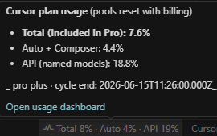

# Cursor plan usage (status bar)

> 🇨🇿 **Česká verze:** [README.cs.md](./README.cs.md) · Project root: [main README](../README.md)

Adds a **status bar** item to Cursor / VS Code showing **Total**, **Auto + Composer** and **API (named)** usage from `https://cursor.com/api/usage-summary` (same data as the official dashboard).

## Quick install

**VSIX (recommended):** download the latest `.vsix` from [GitHub Releases](../../../releases) → in Cursor open **Extensions** panel → `…` → **Install from VSIX…** → select the file.

**From source:** copy `extension.js` + `package.json` into:  
   `%USERPROFILE%\.cursor\extensions\lukasvladyka.cursor-usage-status-0.1.1`  
   (folder name **must** match `publisher.name-version` from `package.json`), then **Developer: Reload Window**.

For development run `code .` here and press **F5**.

## Setting the session token

`Ctrl+Shift+P` → **Cursor usage: Set session token…** → paste the cookie value `WorkosCursorSessionToken` from a logged-in [cursor.com](https://cursor.com) browser session (DevTools → Application → Cookies).

The token is stored in **User Settings** under `cursorUsageStatus.sessionToken`. Never commit it.

## Settings

| Key | Default | Meaning |
|-----|---------|---------|
| `cursorUsageStatus.sessionToken` | empty | Session cookie value (User settings). |
| `cursorUsageStatus.refreshIntervalMinutes` | `5` | Refresh interval in minutes (1–120). |

## Commands

| Command | Purpose |
|---------|---------|
| `Cursor usage: Refresh now` | Refresh immediately (also: click the status bar item). |
| `Cursor usage: Set session token…` | Paste the cookie value (masked input). |
| `Cursor usage: Open dashboard` | Opens [cursor.com/dashboard/usage](https://cursor.com/dashboard/usage). |

## Troubleshooting

- **Orange „set token“ pill** — no token set yet.
- **Red status / HTTP 401** — token expired; refresh from browser and run *Set session token* again.
- **Status bar hidden** — `View → Appearance → Status Bar`.
- **Endpoint** is unofficial — may break if Cursor changes the API response shape.

Full documentation: see the [main README](../README.md).
